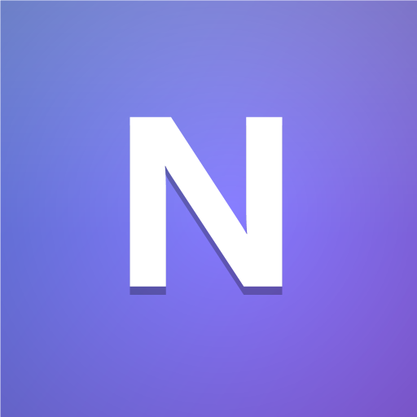

<div align="center">



# NeuzBlox

**Run every Roblox account at once.**

Roblox opens one client and refuses the rest. NeuzBlox holds the lock it checks, then signs
each window into a different account — main on the left, alts beside it, all live at the same time.


</div>

---

## What it is

A single 252 KB executable that launches several Roblox clients side by side, each signed into a
different account. No installer, no runtime download, no admin rights, no NuGet packages.

**It is not an exploit.** Nothing is patched, no memory is read or written, no code is injected
into Roblox, and no gameplay is automated. It starts clients and arranges windows — that's the
whole product.

---

## Quick start

1. Download `NeuzBlox.exe` and run it. The left rail should read **MULTI-INSTANCE — Unlocked**.
2. **Accounts → Add account**, name it, paste that account's `.ROBLOSECURITY` cookie, **Verify and add**.
3. Repeat per account.
4. Pick where to join — leave it on *Roblox app (home)*, or choose *Game / place* and paste a link.
5. Tick the accounts you want → **Launch selected**.

**Instances** then shows every client, what it's doing, and which game it's actually in.

---

## How it works

Three moving parts. None of them touch the Roblox process.

### 1. Hold the lock Roblox checks

On startup the client claims a named Windows kernel object. A second copy finds it taken, hands
off to the first client and quits — that is the entire reason you only ever get one window.

```csharp
new Mutex(false, "ROBLOX_singletonMutex", out createdNew);
// held on a dedicated thread for the app's lifetime —
// mutex ownership dies with the thread that took it
```

If a client was already running when NeuzBlox starts, that client owns the lock. NeuzBlox keeps
asking for it in the background and takes over the moment that client quits, so the unlock doesn't
die with it.

### 2. Mint one launch ticket per account

When you press Play on the website, Roblox issues a single-use authentication ticket for your
session. NeuzBlox asks for exactly the same thing, once per saved account — which is what puts a
different login in each window instead of three copies of one.

```http
POST https://auth.roblox.com/v1/authentication-ticket
→ rbx-authentication-ticket: <single-use ticket>
```

### 3. Hand the ticket to a fresh client

The ticket goes to the client in the same launch URI a browser would send:

```
roblox-player:1+launchmode:play+gameinfo:<ticket>+launchtime:<ms>
  +placelauncherurl:<url-encoded PlaceLauncher>+browsertrackerid:<id>
  +robloxLocale:en_us+gameLocale:en_us
```

**Which client build matters more than it sounds.** NeuzBlox asks Roblox which build is current
rather than trusting the registered `roblox-player` handler, because third-party tools re-point
that handler at other builds:

```http
GET https://clientsettingscdn.roblox.com/v2/client-version/WindowsPlayer
→ { "version": "0.739.0.7390687", "clientVersionUpload": "version-4310300497aa4917" }
```

Launch a build Roblox doesn't consider current and the client bounces through its own installer,
which then opens a client **you never authenticated** — you get whatever account was last signed
in, and the account you picked never appears. If the handler disagrees with Roblox, NeuzBlox says
so in the status bar and launches the current one anyway.

---

## Features

| | |
|---|---|
| **Accounts** | Unlimited, each with its own alias, note and avatar. One-click verify, plus *Verify all* to health-check every saved session. Cookies refresh themselves when Roblox rotates them. |
| **Launching** | Launch one, the ticked ones, or everything — staggered, and strictly one at a time. |
| **Destinations** | Roblox home app, place link or ID, private server link, a specific server by job ID, or follow a user into their game. Save any as a preset. |
| **Instances** | Live state per client: queued → authenticating → starting → running → closed, with PID, uptime and the game it's actually in. |
| **Windows** | Each client's title bar is renamed to its account. One click tiles them all — grid, columns, rows or cascade. |
| **Discord** | Optional rich presence showing the real game and its icon. |
| **Resilience** | Waits out Roblox's own updater with a clock, and retries a client that died during startup. |
| **Interface** | Dark theme, animated loading screen, tray icon. All effects switchable off. |

---

## Discord Rich Presence

Off by default. Tick one box in **Settings → Discord rich presence** and it works — nothing to
paste, nothing to sign up for.

It talks to your own Discord client over its local pipe (`\\.\pipe\discord-ipc-N`) — no library,
no account linking, nothing leaves the machine. Discord itself publishes the status.

**What it shows**

| Situation | Big image | Text |
|---|---|---|
| All clients in the same game | that game's own Roblox icon | game name · client count |
| Different games | NeuzBlox mark | "Playing across 3 games" |
| Roblox home app | NeuzBlox mark | "Browsing the Roblox app" |
| Nothing running | NeuzBlox mark | "Idle in the launcher" |

Account names are **hidden by default** — the status shows counts only. Showing them is a separate
tickbox, because your Discord friends would be able to read your alt names.

<details>
<summary><b>How the game and its icon are detected</b></summary>

<br>

Launching into a place tells NeuzBlox the place up front. But most sessions open the Roblox app and
pick a game *inside* the client, where nothing from launch knows where you ended up. So NeuzBlox
reads what the client writes about itself:

```
[FLog::Output] ! Joining game '<jobId>' place <placeId> at <ip>
... userid:<accountId>
```

Every client keeps its own log, each carries the account's `userid`, and whichever of
`! Joining game` or `returnToLuaApp` appears last says where it is right now. Read-only, on a
background thread, opened with full sharing because the client still has the file open.

**A log file is not proof of a running client.** It outlives the client that wrote it, and a client
that was killed never logs `returnToLuaApp` — so its last line is still a join, for hours. NeuzBlox
therefore only trusts a log it can pair with a client process that is running *right now*, matching
the client's start time against the timestamp in the log's filename. No matching process, no game.

For the icon: Discord accepts a raw `https://` image URL in an asset slot and proxies it into an
`mp:external/...` asset itself, so game art needs no token and no pre-registration. A hand-built
`mp:` key is *not* accepted — pass the plain URL and let Discord convert it.

</details>

<details>
<summary><b>Using your own Discord application</b></summary>

<br>

NeuzBlox ships with an application ID baked in (`AppInfo.DefaultDiscordAppId`), which is why the
checkbox alone is enough. An application ID is public — it travels inside every presence payload
anyone publishes — so shipping one is normal and safe. Client *secrets* and bot tokens are the
parts that must never appear in source, and none are used here.

To publish under your own app instead: create one at
[discord.com/developers](https://discord.com/developers/applications), upload `art/logo_big.png`
and `art/logo_small.png` under **Rich Presence → Art Assets** named exactly `logo_big` and
`logo_small`, then paste the Application ID into the optional field at the bottom of the card.
Leave it empty to use the built-in one.

</details>

---

## Your accounts stay on your machine

| What | Where |
|---|---|
| Account sessions | `%LOCALAPPDATA%\NeuzBlox\accounts.dat` — encrypted |
| Settings | `%LOCALAPPDATA%\NeuzBlox\settings.json` |
| Log | `%LOCALAPPDATA%\NeuzBlox\neuzblox.log` |
| Avatar cache | `%LOCALAPPDATA%\NeuzBlox\cache\` |

`accounts.dat` is sealed with **Windows DPAPI**, scoped to your Windows user on this PC. Another
Windows account on the same machine cannot read it, and copying the file elsewhere gives nothing.
Nothing is uploaded anywhere except to roblox.com.

**Settings → Stored data → Delete all saved accounts** wipes it.

> ### ⚠️ Treat a cookie like a password
>
> A `.ROBLOSECURITY` value is a **full login** — no password prompt, no 2FA. Only ever paste one
> you copied yourself, from your own browser, and never into a site or tool you don't trust.
>
> **"Log out of all sessions"** on roblox.com invalidates every cookie for that account, including
> any saved here. That is your kill switch.

<details>
<summary><b>Getting a .ROBLOSECURITY cookie</b></summary>

<br>

1. Sign in to the account in a browser.
2. **F12** → **Application** tab (Chrome/Edge) or **Storage** (Firefox).
3. **Cookies → https://www.roblox.com**
4. Copy the whole `.ROBLOSECURITY` value — it starts with `_|WARNING:-DO-NOT-SHARE-THIS...`.
   Copy the warning text too.
5. Paste it into NeuzBlox and press **Verify and add**. It fills in the username, ID and avatar.

For several accounts, use a different browser profile or a private window per account so you're not
constantly signing in and out.

</details>

---

## Build from source

Nothing to install. It builds with the C# compiler that ships inside Windows.

```bat
build.cmd
```

That regenerates the icon and produces `NeuzBlox.exe` in the project root.

```
src/      application source
  Program.cs        entry point, single-instance guard, TLS setup
  Splash.cs         loading screen (does the slow half of startup)
  MainForm.cs       shell, pages, launch orchestration
  Anim.cs           easing engine, one shared 60fps clock
  MultiInstance.cs  the singleton-lock holder
  RobloxApi.cs      auth ticket, whoami, thumbnails, game icons
  RobloxClient.cs   client discovery, join targets, launch URI
  GameWatcher.cs    reads client logs to find the live game
  DiscordRpc.cs     rich presence over Discord's IPC pipe
  Instances.cs      instance lifecycle, watchdog, window tiling
  Config.cs         settings + DPAPI account vault
  Theme.cs          dark theme and custom controls
  AccountCard.cs    account row
  InstanceCard.cs   instance row
  Dialogs.cs        modal shells, add/edit account
  Native.cs         Win32 interop
  Json.cs           minimal JSON reader/writer
tools/    dev helpers (icon + art generators, self test, RPC probe)
art/      Discord Rich Presence art assets
site/     landing page
```

No third-party code: the JSON parser, dark theme, animation engine and Discord presence client are
all hand-written.

`tools/SelfTest.cs` exercises the non-UI plumbing — client discovery, link parsing, launch-URI
shape, Roblox connectivity and the account vault — without needing a real account.

---

## Troubleshooting

<details>
<summary><b>The second client closes itself a few seconds after opening</b></summary>

<br>

Almost always Roblox updating itself. A client that finds its install incomplete spawns its own
installer, and two installers at once abort each other with *"another RobloxPlayerInstaller is
running"* — taking both clients down.

NeuzBlox handles this: it waits out the installer with a visible clock, starts clients strictly one
at a time, and retries one that died during startup. If it says **"Roblox is installing its own
update"**, leave it open — it will continue by itself.

</details>

<details>
<summary><b>The wrong account opens, or only one account ever appears</b></summary>

<br>

Something has re-pointed Windows' `roblox-player` link at a build Roblox doesn't consider current —
version spoofers and some executors do this. That client bounces through its installer, which opens
a client NeuzBlox never authenticated, so you get the last signed-in account instead.

NeuzBlox detects this and launches the current build anyway, telling you in the status bar. To force
a specific build instead, set it in **Settings → Roblox client → Browse**.

</details>

<details>
<summary><b>"Session expired — re-add this account with a fresh cookie"</b></summary>

<br>

That cookie was invalidated, usually by a password change or by logging out of all sessions. Copy a
fresh one.

</details>

<details>
<summary><b>"Shared with a client" instead of "Unlocked"</b></summary>

<br>

A Roblox client that was already open owns the lock. Everything still works; NeuzBlox takes
ownership automatically the moment that client closes.

</details>

<details>
<summary><b>Discord presence isn't showing</b></summary>

<br>

The Discord **desktop** app has to be running — the browser version exposes no pipe. Check
**Discord → Settings → Activity Privacy → Share your detected activities** is on (it is by default).
Rejections are written to `neuzblox.log`.

</details>

<details>
<summary><b>Roblox share links (roblox.com/share?code=...)</b></summary>

<br>

These can't be resolved offline. Open the link once in a browser and paste the `roblox.com/games/...`
URL it lands on.

</details>

Anything unexpected lands in `%LOCALAPPDATA%\NeuzBlox\neuzblox.log`.

---

## Worth knowing

Each client is a full Roblox instance — CPU, GPU and a couple of GB of RAM each. Four at once on a
mid-range machine is usually the practical ceiling.

Roblox allows multiple accounts. How you use them is between you and Roblox's Terms of Use — this
tool takes no position on that and does nothing to hide itself.

---

<div align="center">

Made by **[neuzgg](https://github.com/neuzgg)**

<sub>Not affiliated with, endorsed by, or sponsored by Roblox Corporation.<br>
Roblox is a trademark of Roblox Corporation.</sub>

</div>
